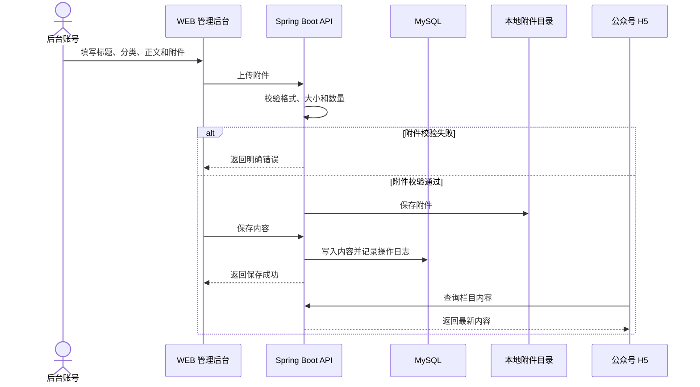
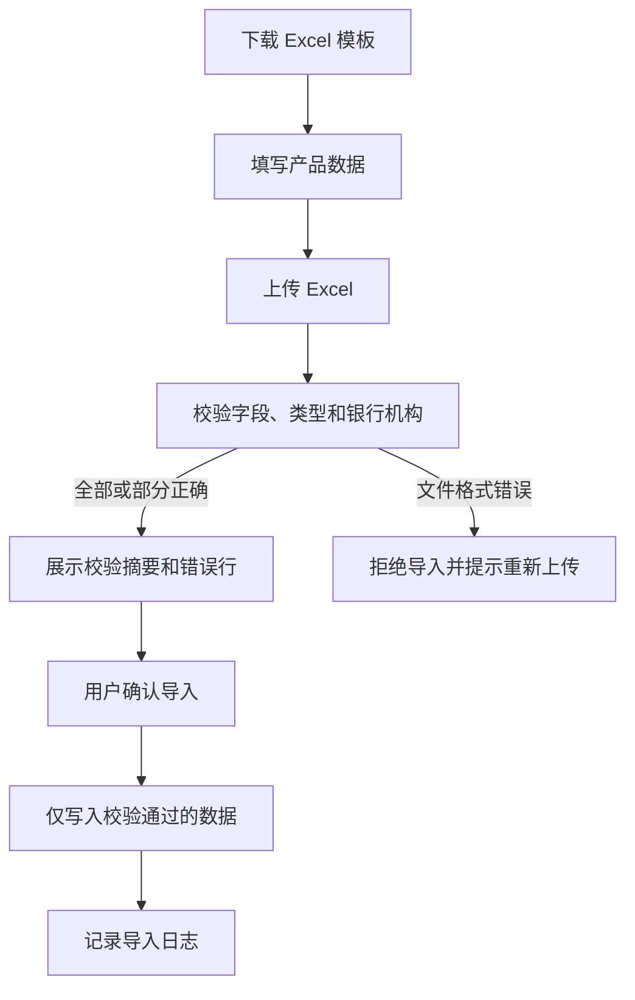
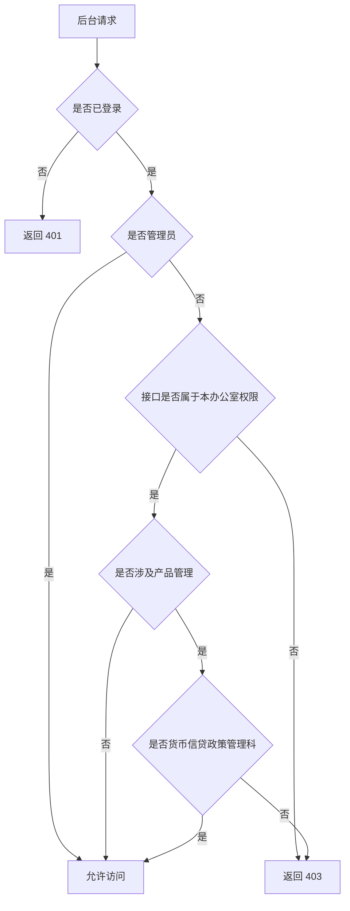
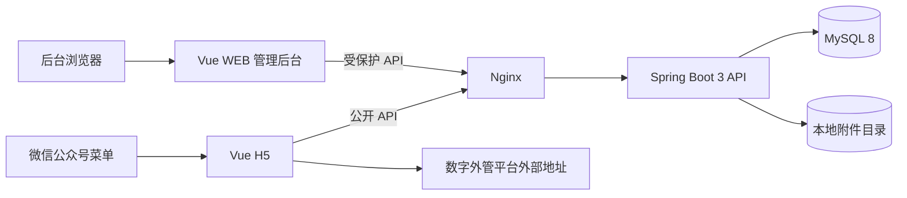

# 央行 E 平台 PRD

> 状态：产品设计定稿。本文档与已确认 Pencil 原型、`docs/api-contracts.md` 和 `docs/Plan.md` 共同构成开发依据。

## 1. 产品目标

央行 E 平台是一套面向微信公众号入口的轻量内容发布平台，包含公开 H5、WEB 管理后台和统一业务服务端。

- 公众无需登录即可浏览金融服务、乡村振兴内容和助企金融产品。
- 后台账号按角色和所属办公室维护展示内容。
- 首版强调低维护成本：保存后立即展示，删除后立即移除。
- 首版不接入微信授权，不采集访客信息，不设置草稿、审核、发布或下架状态。

## 2. 已确认范围

### 2.1 MVP

| 模块 | 包含功能 |
| --- | --- |
| 微信公众号 H5 | 金融服务、乡村振兴、文章详情、产品详情、附件下载、SAFE 浮动入口 |
| 内容管理 | 查询、新增、编辑、查看、删除、富文本、附件上传 |
| 助企金融产品 | 查询、新增、编辑、查看、删除、模板下载、Excel 导入校验、首批预置 112 条 |
| 后台账号 | 登录、工作概览、权限控制、账号管理、密码重置、本人修改密码 |
| 操作日志 | 记录新增、修改、删除、导入、账号管理和密码修改 |
| 固定配置 | 17 项银行机构、14 个发布办公室、2 类产品、4 个县域服务队、SAFE 地址和 Logo |
| 附件存储 | 服务器本地目录、配置化路径、备份 |

### 2.2 V2+

| 功能 | 延后理由 |
| --- | --- |
| 微信授权与访客画像 | 当前 H5 明确公开访问 |
| H5 搜索与高级筛选 | 首版通过栏目 Tab 浏览 |
| 草稿、审核和下架流程 | 当前要求保存后立即展示 |
| 银行机构后台维护 | 银行机构已确认写死 |
| 服务队后台维护 | 服务队内容固定写入 H5 |
| 对象存储 | 首版本地附件目录即可满足部署 |
| 复杂审计报表 | 首版只需要简洁操作追溯 |

### 2.3 路线图

| 阶段 | 交付内容 | 验收门禁 |
| --- | --- | --- |
| 阶段 1：前端 MVP | Vue H5 与 WEB 后台全部页面，使用契约一致的 Mock 数据 | 页面与 Pencil 原型一致，typecheck、test、build 和浏览器检查通过 |
| 阶段 2：后端基础设施 | Spring Boot、统一响应、异常处理、数据库迁移、Security、CORS、健康检查 | Maven 测试、短时启动和 `GET /health` 通过 |
| 阶段 3：逐功能闭环 | 认证、公开查询、附件、内容、产品、导入、账号、日志、概览、初始数据 | 每个模块在 `VITE_USE_MOCK=false` 下完成真实联调 |
| 阶段 4：交付 | 全链路 E2E、启动文档和部署前检查 | 自动回归通过，用户完成最终验收 |

## 3. 固定配置

### 3.1 发布办公室

固定包含 14 个单位：

1. 货币信贷政策管理科
2. 宏观审慎与金融市场管理科
3. 金融稳定科
4. 统计研究科
5. 支付结算科
6. 货币金银科
7. 国库科
8. 征信管理科
9. 反洗钱科
10. 外汇管理科
11. 肇州县
12. 肇源县
13. 林甸县
14. 杜蒙县

### 3.2 银行机构

银行下拉列表严格按参考 Excel 的“银行机构”列去重，固定为 17 项：

1. 农发行大庆市分行
2. 中国工商银行
3. 农业银行
4. 中国银行
5. 建设银行
6. 交通银行大庆分行
7. 阳光惠农贷
8. 广发银行
9. 兴业银行
10. 招商银行
11. 浦发银行大庆分行
12. 中国民生银行大庆分行
13. 中信银行
14. 哈尔滨银行
15. 昆仑银行
16. 龙江银行
17. 光大银行

特殊行 `阳光惠农贷` 的银行机构和产品名称均使用 `阳光惠农贷`，其余字段按参考表顺延整理。

### 3.3 其他固定项

- 内容分类：`SERVICE_GUIDE` 服务指引、`POLICY_PROMOTION` 政策宣传。
- 产品类型：`AGRICULTURAL` 涉农产品、`SMALL_MICRO` 小微产品。
- 县域：`ZHAOZHOU` 肇州县、`ZHAOYUAN` 肇源县、`LINDIAN` 林甸县、`DUMENG` 杜蒙县。
- 数字外管平台地址：`http://zwfw.safe.gov.cn/asone/`。
- SAFE Logo：`docs/assets/safe-logo.png`。
- 四县金融业务服务队介绍、成员姓名、职务和联系电话固定写入 H5，不提供后台维护入口。

## 4. 页面与原型映射

已确认原型文件：`docs/prototypes/central-bank-e-platform.pen`。

### 4.1 H5 页面

| 原型编号 | 页面 | 核心内容 |
| --- | --- | --- |
| H01-A | 金融服务 - 服务指引列表 | 市级科室服务指引，倒序加载 |
| H01-B | 金融服务 - 政策宣传列表 | 政策宣传，倒序加载 |
| H01-C | 金融服务 - 助企通道产品列表 | 银行机构、产品名称、类型 |
| H01-D | 乡村振兴 - 肇州县服务指引 | 四县切换和三级文字 Tab |
| H01-E | 乡村振兴 - 肇州县金融业务服务队 | 固定介绍、成员、职务、电话 |
| H02 | 文章详情 | 富文本正文、发布信息、附件下载 |
| H03 | 产品详情 | 产品身份卡和业务详情卡 |

### 4.2 WEB 管理后台

| 原型编号 | 页面 | 核心内容 |
| --- | --- | --- |
| A01 | 后台登录 | 账号、密码、记住登录状态 |
| A02 | 工作概览 | 内容数、产品数、账号数、当日操作数、快捷入口 |
| A03 | 内容管理列表 | 标题、分类、发布机构、发布时间、操作 |
| A04 | 发布内容 | 标题、分类、发布机构、富文本正文、附件 |
| A05 | 金融产品列表 | 产品名称、银行机构、类型、更新时间、操作、下载模板、Excel 导入 |
| A06 | 新增金融产品 | 银行机构、产品名称、类型、准入条件、产品介绍、业务经办人、联系方式 |
| A07 | Excel 导入金融产品 | 上传、校验、结果确认 |
| A08 | 账号管理列表 | 登录账号、姓名、角色、所属机构、状态、操作 |
| A09 | 新增账号 | 登录账号、姓名、角色、所属机构、初始密码、状态 |
| A10 | 操作日志 | 操作时间、操作人、类型、对象、操作说明 |
| A11 | 修改密码 | 当前密码、新密码、确认新密码 |
| A12 | 内容详情预览 | 分类、标题、发布信息、正文、附件 |

## 5. H5 交互设计

### 5.1 首页

- 页面最顶部直接展示一级 Tab，不展示平台名称、Logo 横幅或独立头部。
- 一级 Tab：`金融服务`、`乡村振兴`，使用浅蓝容器和高对比分段按钮。
- 金融服务二级 Tab：`服务指引`、`政策宣传`、`助企通道`，居中胶囊按钮。
- 乡村振兴二级 Tab：`肇州县`、`肇源县`、`林甸县`、`杜蒙县`，居中胶囊按钮。
- 乡村振兴三级 Tab：`服务指引`、`金融业务服务队`，使用文字导航和底部短指示线，不使用胶囊样式。
- 列表区域不展示“按发布时间倒序”等说明文案。
- 服务指引和政策宣传卡片固定高度，标题位于顶部；发布办公室和发布时间下沉至卡片底部。
- 助企通道列表卡片与政策宣传卡片高度一致，只显示银行机构、产品名称、类型。
- 列表支持分页加载更多，无内容显示空状态，请求失败显示重试入口。

### 5.2 文章详情

- 展示完整标题、发布办公室、发布时间、富文本正文和附件列表。
- 正文支持标题、段落、列表、链接和内嵌图片。
- 纵向长图片按页面宽度自适应，支持点击查看原图。
- 每篇文章最多 3 个附件，逐个下载。
- PDF、Word 和 Excel 不在 H5 中强制预览。
- 超长表格以附件形式下载，不嵌入移动端横向滚动区域。

### 5.3 产品详情

产品详情只展示以下 7 项，不增加其他业务字段：

1. 银行机构
2. 产品名称
3. 类型
4. 准入条件
5. 产品介绍
6. 业务经办人
7. 联系方式

页面采用两层卡片结构：

- 顶部身份卡展示产品名称、银行机构和类型。
- 下方业务详情卡展示准入条件、产品介绍、业务经办人和联系方式。
- 两个模块之间保留清晰间距，卡片使用轻量阴影，详情字段之间使用细分割线。

### 5.4 SAFE 浮动入口

- 非详情页面右下角显示蓝色 SAFE Logo 按钮。
- 点击后向左展开 `Logo + 国家外汇管理局数字外管平台`。
- 点击展开区域跳转固定地址。
- 展开区域提供关闭按钮，点击后向右收起。
- H02 和 H03 详情页隐藏浮动入口。

## 6. WEB 管理后台功能

### 6.1 登录与概览

- 后台用户使用账号密码登录，可记住登录状态。
- 登录失败显示明确提示。
- 登录后进入工作概览或首个有权限菜单。
- 工作概览展示内容、产品、账号和当日操作统计，并提供快捷入口。

### 6.2 内容管理

- 查询条件：标题、分类、发布办公室、发布时间范围。
- 列表字段：标题、分类、发布办公室、发布时间、操作；不展示附件个数。
- 操作：查看、新增、编辑、删除、分页。
- 新增或编辑字段：标题、分类、发布办公室、富文本正文、附件。
- 每篇内容最多上传 3 个附件，单个不超过 20 MB。
- 附件格式：PDF、Word、Excel。
- 保存后立即展示，删除后立即从 H5 移除。

### 6.3 金融产品

- 查询条件：产品名称、银行机构、类型。
- 列表字段：产品名称、银行机构、类型、更新时间、操作；不展示参考利率。
- 操作：查看、新增、编辑、删除、分页、下载模板、Excel 导入。
- 产品字段严格限制为：银行机构、产品名称、类型、准入条件、产品介绍、业务经办人、联系方式。
- Excel 导入先校验后提交；错误行不写入。
- 首次上线预置参考 Excel 中的 112 条产品：涉农产品 52 条，小微产品 60 条。

### 6.4 账号管理

- 仅管理员可见。
- 支持新增、查看、修改、删除账号和重置密码。
- 普通账号只能修改自己的密码。
- 普通账号固定绑定一个发布办公室；管理员不绑定单位。

### 6.5 操作日志

- 仅管理员可见。
- 记录操作人、操作时间、操作类型、操作对象类型、操作对象名称和操作说明。
- 支持按操作人、类型和时间范围查询并分页。

## 7. 权限规则

| 角色或办公室 | 权限 |
| --- | --- |
| 管理员 | 管理全部内容、产品、账号和日志，不绑定办公室 |
| 普通办公室账号 | 仅管理本办公室内容，修改本人密码 |
| 四县账号 | 仅管理本县服务指引，修改本人密码 |
| 货币信贷政策管理科账号 | 管理本办公室内容，并管理金融产品 |

服务端必须逐接口校验权限，不能只依赖前端菜单隐藏。

服务指引自动分流：

| 发布办公室 | H5 展示位置 |
| --- | --- |
| 市级科室 | `金融服务 > 服务指引` |
| 肇州县 | `乡村振兴 > 肇州县 > 服务指引` |
| 肇源县 | `乡村振兴 > 肇源县 > 服务指引` |
| 林甸县 | `乡村振兴 > 林甸县 > 服务指引` |
| 杜蒙县 | `乡村振兴 > 杜蒙县 > 服务指引` |

## 8. 数据对象

### 8.1 内容

| 字段 | 类型 | 说明 |
| --- | --- | --- |
| `id` | Long | 内容 ID |
| `title` | String | 标题 |
| `category` | Enum | `SERVICE_GUIDE` 或 `POLICY_PROMOTION` |
| `office_code` | String | 发布办公室编码 |
| `office_name` | String | 发布办公室名称 |
| `county_code` | String 或 null | 县域服务指引自动分流编码 |
| `rich_text_html` | String | 安全过滤后的正文 |
| `published_at` | DateTime | 发布时间 |
| `attachments` | Array | 最多 3 个附件 |

### 8.2 附件

| 字段 | 类型 | 说明 |
| --- | --- | --- |
| `id` | Long | 附件 ID |
| `file_name` | String | 原始文件名 |
| `file_type` | Enum | `PDF`、`WORD`、`EXCEL` |
| `file_size` | Long | 字节数 |
| `download_url` | String | 下载地址 |

### 8.3 金融产品

| 字段 | 类型 | 说明 |
| --- | --- | --- |
| `id` | Long | 产品 ID |
| `bank_code` | String | 固定银行编码 |
| `bank_name` | String | 银行机构 |
| `product_name` | String | 产品名称 |
| `product_type` | Enum | `AGRICULTURAL` 或 `SMALL_MICRO` |
| `admission_conditions` | String | 准入条件 |
| `product_intro` | String | 产品介绍 |
| `business_manager` | String | 业务经办人 |
| `contact_info` | String | 联系方式 |
| `updated_at` | DateTime | 更新时间 |

### 8.4 后台账号

| 字段 | 类型 | 说明 |
| --- | --- | --- |
| `id` | Long | 账号 ID |
| `username` | String | 登录账号 |
| `display_name` | String | 姓名 |
| `role` | Enum | `ADMIN` 或 `OFFICE_USER` |
| `office_code` | String 或 null | 普通账号所属办公室 |
| `enabled` | Boolean | 是否启用 |

### 8.5 操作日志

| 字段 | 类型 | 说明 |
| --- | --- | --- |
| `id` | Long | 日志 ID |
| `operator_name` | String | 操作人 |
| `operation_type` | Enum | `CREATE`、`UPDATE`、`DELETE`、`IMPORT`、`ACCOUNT`、`PASSWORD` |
| `object_type` | String | 对象类型 |
| `object_name` | String | 对象名称 |
| `description` | String | 操作说明 |
| `operated_at` | DateTime | 操作时间 |

## 9. 核心流程

### 9.1 内容发布



### 9.2 产品导入



### 9.3 权限校验



## 10. 技术架构蓝图

### 10.1 技术选型

| 层级 | 技术 |
| --- | --- |
| H5 与 WEB 后台 | Vue 3、TypeScript、Pinia、Vue Router、Vite、Axios |
| 服务端 | Java 17+、Spring Boot 3.x、Spring Web、Spring Validation、Spring Security、Spring Data JPA |
| 数据库 | MySQL 8，测试使用隔离 H2 |
| 数据库迁移 | Flyway |
| 附件 | 服务器本地配置化目录 |
| 部署 | Nginx 静态资源与反向代理、Spring Boot JAR、MySQL、附件备份 |

### 10.2 架构图



### 10.3 服务端分层

```text
controller -> service -> repository -> database
             |
             +-> storage service -> local attachment directory
```

- Controller 仅处理 HTTP 参数、认证上下文和统一响应。
- Service 承载权限、事务、富文本过滤、自动分流和导入校验。
- Repository 仅负责持久化访问。
- DTO 与 JPA Entity 分离，禁止直接返回 Entity。

## 11. 组件交互说明

| 模块 | 调用关系 | 关键约束 |
| --- | --- | --- |
| H5 列表 | 页面 -> `publicContentService` / `publicProductService` -> 公开 API | 列表分页加载，产品列表只取摘要字段 |
| H5 详情 | 页面 -> 对应公开详情 API | H02 展示附件；H03 只展示 7 个产品字段 |
| 内容编辑 | 页面 -> 附件上传 API -> 内容保存 API | 保存前附件最多 3 个 |
| 产品导入 | 页面 -> 模板下载 -> 校验 API -> 提交 API | 使用一次性 `import_token` 防止重复提交 |
| 权限菜单 | 登录 Store -> `/api/auth/me` -> 路由守卫 | 服务端仍需逐接口校验 |
| 操作日志 | 业务 Service -> AuditLogService | 关键操作统一记录 |

## 12. 部署方案

```text
Nginx
  /h5/      -> frontend dist H5 入口
  /admin/   -> frontend dist WEB 后台入口
  /api/     -> Spring Boot API
  /files/   -> Spring Boot 受控附件下载

Spring Boot
  server.port = 8099（Agent 验证）
  server.port = 8003（用户验收）

MySQL 8
  独立业务库

附件目录
  APP_STORAGE_ROOT 指定
  纳入定期备份
```

## 13. 风险与缓解

| 风险 | 缓解方案 |
| --- | --- |
| 富文本脚本注入 | 服务端使用白名单过滤，前端不执行不受信任脚本 |
| 附件滥用 | 限制数量、大小、扩展名和 MIME 类型；下载统一走受控接口 |
| 普通账号越权 | Spring Security 与 Service 双重校验办公室权限 |
| Excel 数据脏值 | 模板下载、导入前校验、错误行反馈、仅提交正确行 |
| 本地附件丢失 | 配置独立目录，部署时纳入备份 |
| 详情页信息堆叠 | 产品详情拆分身份卡和业务详情卡，字段严格限制为 7 项 |

## 14. 验收标准

- H5 公开访问，无需微信授权。
- H5 Tab、列表、加载更多、空状态、重试、详情和附件下载可用。
- 服务指引按发布办公室自动进入市级或县域栏目。
- SAFE 浮动入口可展开、收起和跳转，详情页隐藏。
- 后台登录、概览、内容管理、产品管理、模板下载、导入、账号和日志可用。
- 普通账号不能跨办公室操作；四县账号只能发布服务指引。
- 产品详情和产品编辑只包含已确认的 7 个字段。
- 初始产品导入共 112 条：涉农产品 52 条，小微产品 60 条。
- 富文本安全过滤、附件限制、操作日志和异常提示验证通过。
